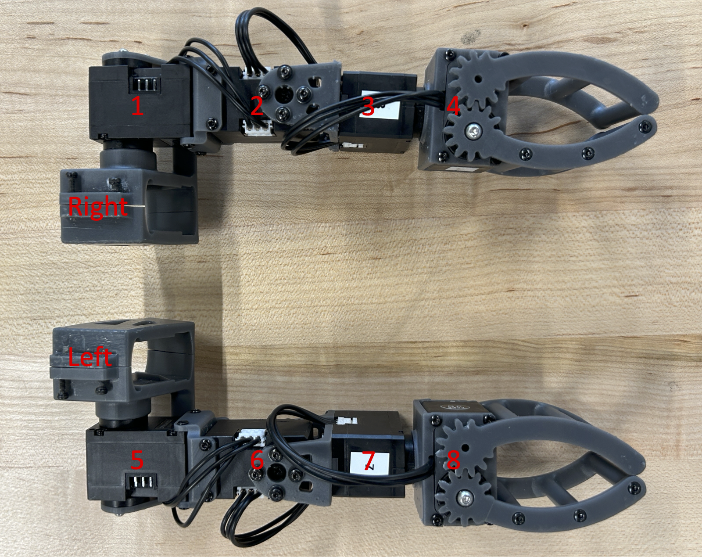
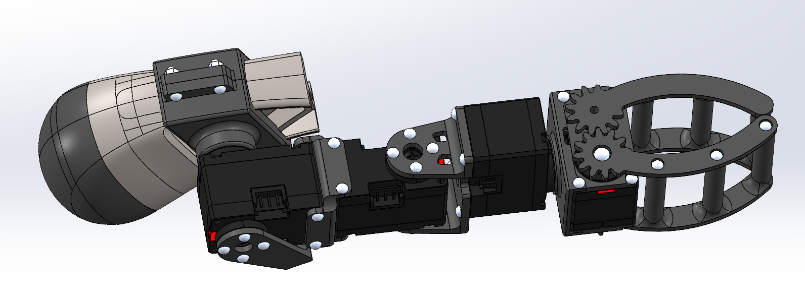
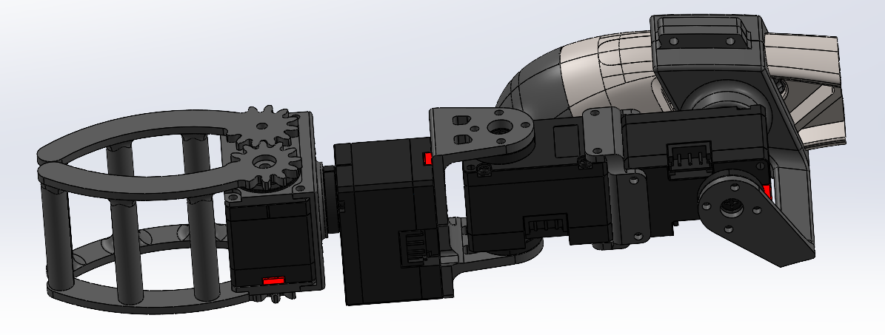

## Hardware Setup

### Bill of Materials
To begin, gather the following materials. For easier servo configuration, consider purchasing the [DYNAMIXEL Starter Set](https://www.robotis.us/dynamixel-starter-set-us/) instead of just the DYNAMIXEL U2D2 (ID 9 in the BOM).

| ID | Part                                      | Description                              | Price (per unit) | Quantity |
|----|-------------------------------------------|-----------------------------------|--------------|----------|
| 0 | [Unitree Go1 Robot](https://www.unitree.com/go1/) | Edu version |  | 1 |
|1-8| [DYNAMIXEL XC330-T288-T](https://www.robotis.us/dynamixel-xc330-t288-t/) | Servos for the manipulators | $89.90 | 8 |
| 9 | [DYNAMIXEL U2D2](https://www.robotis.us/u2d2/) | Convert control signals from PC to servos | $32.10 | 1 |
| 10 | [3P JST Expansion Board](https://www.robotis.us/3p-jst-expansion-board/) | Combine control signal and power to the manipulators | $5.90 | 1 |
| 11 | [100cm 3 Pin JST Cable (5pcs)](https://a.co/d/86x52YO) | Connect manipulators to the expansion board | $10.19 | 1 |
| 12 | [24V to 12V 10A Converter](https://a.co/d/bhacse1) | Convert 24V power from Go1 to 12V for the manipulators | $9.75 | 1 |
| 13 | [30cm XT30 Connector (2pcs)](https://a.co/d/2ftzIKc) | Connect Go1 power supply to the converter | $8.59 | 1 |
| 14 | [20ft Ethernet Cable](https://a.co/d/bZTsqN4) | Connect PC to Go1 | $18.99 | 1 |
| 15 | [20ft USB Extension Cable](https://a.co/d/3ieBPJI) | Connect PC to U2D2 | $18.99 | 1 |
| 16 | [Bearings 5x8x2.5mm (10pcs)](https://a.co/d/0Kc5usm) | Bearings for the rotational gripper | $8.19 | 1 |
| 17 | [M2 Screws: 22x4cm, 24x6cm, 48x10cm; Nuts: 8xM2](https://a.co/d/6fwfDas) | Used for assembly | $8.29 |1|
| 18 | [M2.5 Screws: 2x10cm, 2x6cm](https://a.co/d/dnSxZVM) | Used for assembly | $11.99 |1|
| 19 | [Spring Washer: 24xM2, 2xM2.5](https://a.co/d/fyb38Bh) | Used for assembly | $9.99 |1|
| 20 | [Joystick (optional)](https://a.co/d/8otPZM6) | Refer to [joystick.py](../../teleoperation/joystick.py) |  |1|
| 21 | [Printed parts](/locoman_hardware/print) | 3D print them |  |1|

### Configure the servos
Use [Dynamixel Wizard](https://emanual.robotis.com/docs/en/software/dynamixel/dynamixel_wizard2/) to adjust the ID, baud rate, and latency (reference to the [guide](https://github.com/ROBOTIS-GIT/DynamixelSDK/issues/316)). Make the following changes:

- Relabel the motor IDs: [1, 2, 3, 4] for the **right** manipulator and [5, 6, 7, 8] for the **left** manipulator.
- Set the baud rate to 1000000.
- Set the return delay time to 0.

### Assemble the manipulators
   - Refer to [the image of the IDs of the servos](./manipulators.png) to select the correct servos for the corresponding manipulators
   

   - Check out [loco-manipulator_left_fabrication.SLDASM](../assembly/loco-manipulator_left_fabrication.SLDASM) to see how to assemble the manipulators using servos, screws, nuts, and spring washers. It's important that the left manipulator appears as shown below when all servos are in their zero positions.
   

   - Note that the zero positions of the servos differ between the simulation and the real manipulators. Specifically, in simulation (URDF), the first servo of each manipulator points forward, as seen in [loco-manipulator_left_urdf.SLDASM](../assembly/loco-manipulator_left_urdf.SLDASM). Therefore, during the assembly process, you should refer to [loco-manipulator_left_fabrication.SLDASM](../assembly/loco-manipulator_left_fabrication.SLDASM).
   

### Setup the robot
We use the following setup to perform the demos in the paper. A desktop sends control signals to the robot via an Ethernet cable (ID-14) and to the manipulators via a USB cable (ID-15). Before running the code, make sure to turn on the Go1 robot, which will also power the servos.

