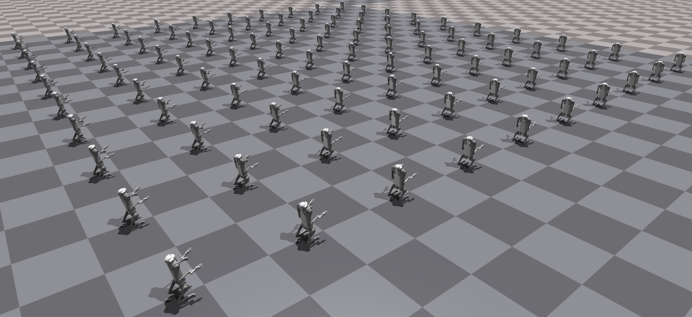
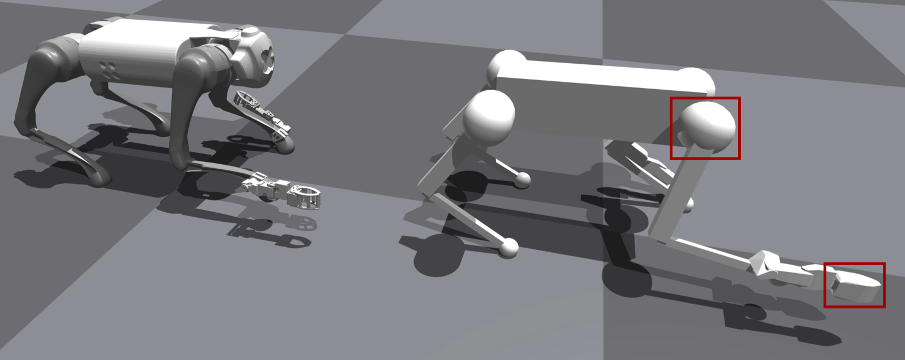

<!-- <h1 align="center">
  LocoMan
</h1> -->
<h2 align="center">
  LocoMan: Advancing Versatile Quadrupedal Dexterity with Lightweight Loco-Manipulators
</h2>

<div align="center">
  <a href="https://linchangyi1.github.io/"><strong>Changyi Lin</strong></a>,
  <a href="https://xingyul.github.io/"><strong>Xingyu Liu</strong></a>,
  <a href="https://yxyang.github.io/"><strong>Yuxiang Yang</strong></a>,
  <a href="https://yaruniu.com/"><strong>Yaru Niu</strong></a>,
  <br/>
  <a href="https://wenhaoyu.weebly.com/"><strong>Wenhao Yu</strong></a>,
  <a href="https://research.google/people/tingnan-zhang/"><strong>Tingnan Zhang</strong></a>,
  <a href="https://www.jie-tan.net/"><strong>Jie Tan</strong></a>,
  <a href="https://homes.cs.washington.edu/~bboots/"><strong>Byron Boots</strong></a>,
  <a href="https://safeai-lab.github.io/people.html"><strong>Ding Zhao</strong></a>
  <br/>
</div>

<p align="center">
    <a href="https://linchangyi1.github.io/LocoMan/"><em>Website</em></a> |
    <a href="https://arxiv.org/abs/2403.18197"><em>Paper</em></a>
</p>


<p align="center">

<br/>
<br/>

</p>

<!-- --- -->
<!-- <br/> -->

## Table of Contents
1. [Overview](#overview)
2. [Installation](#installation)
3. [Running in Simulation](#simulation)
4. [Real Robot Deployment](#deployment)
   1. [Hardware Setup](#hardware)
   2. [Running LocoMan in Real World](#fsm_real)
5. [Notes for Future Development](#notes)


## Overview <a name="overview"></a>
This repository provides the open-source files for [LocoMan](https://linchangyi1.github.io/LocoMan/).

Key features:
   - **Hardware**: Files available in `.sldprt` and `.sldasm` formats for development, and `.stl` format for fabrication.
   - **System**: Unified codebase for both simulation and real robot deployment, toggled via the `--use_real_robot` argument. It also contains a Python-based whole-body impulse controller.

## Installation <a name="installation"></a>
#### Basic Installation
1. Create a conda environment with python3.8:
   ```bash
   conda create -n locoman python=3.8
   ```
2. Install the dependencies:
   ```bash
   conda activate locoman
   pip install -e .
   conda install pinocchio -c conda-forge
   ```
   Note that the `numpy` version should be no later than `1.19.5` to avoid conflict with the Isaac Gym utility files. But we can modify 'np.float' into 'np.float32' in the function 'get_axis_params' of the python file in 'isaacgym/python/isaacgym/torch_utils.py' to resolve the issue. So don't worry about the version limitation.
3. Install [ROS Neotic](https://wiki.ros.org/noetic/Installation/Ubuntu) (we only test the code on Ubuntu 20.04).

#### Isaac Gym Installation (required only for simulation)
1. Download [IsaacGym Preview 4](https://developer.nvidia.com/isaac-gym).
2. Install IsaacGym:
   ```bash
   conda activate locoman
   cd isaacgym/python && pip install -e .
   ```
3. Try running an example `cd examples && python 1080_balls_of_solitude.py`. The code is set to run on CPU so don't worry if you see an error about GPU not being utilized.

#### Go1 SDK Installation (required only for real robot deployment)
1. Download the SDK:
   ```bash
   cd locoman
   git clone https://github.com/unitreerobotics/unitree_legged_sdk.git
   ```
2. Make sure the required packages are installed, following Unitree's [guide](https://github.com/unitreerobotics/unitree_legged_sdk). Most notably, please make sure to install `Boost` and `LCM`:
   ```bash
   sudo apt install libboost-all-dev liblcm-dev
   pip install empy catkin_pkg
   ```
3. Then, go to the `unitree_legged_sdk` directory and build the libraries:
   ```bash
   cd unitree_legged_sdk
   mkdir build && cd build
   cmake -DPYTHON_BUILD=TRUE ..
   make
   ```

## Running in Simulation <a name="simulation"></a>
1. Start ROS:
   ```bash
   roscore
   ```
2. Run the Joystick (for a better understanding of the teleoperation process, it's recommended to review the comments in [joystick.py](/teleoperation/joystick.py)):
   ```bash
   python teleoperation/joystick.py
   ```
3. Run LocoMan in Simulation:
   - By default, the robot is equiped **with** two manipualtors. To run:
      ```bash
      python script/play_fsm.py
      ```
   - For playing a pure Go1 robot **without** manipulators, run:
      ```bash
      python script/play_fsm.py --use_gripper=False
      ```


## Real Robot Deployment <a name="deployment"></a>
If you have a Unitree GO1 robot but do not plan to build the loco-manipulators, you can skip the hardware setup and still use this repository for locomotion and foot-based manipulation. However, to access the full functionality of LocoMan on a real robot, you will need to build a pair of loco-manipulators.

#### Hardware Setup <a name="hardware"></a>
Refer to the [LocoMan Hardware Guide](./LocoMan_Hardware/doc/hardware.md) for instructions on setting up the robot.

#### Before Running the Code
Once the hardware is ready, connect the USB to your computer and power on the robot. Then, check the USB ID and enable the USB device for communication (modify the USB ID based on the output of the first command):
   ```bash
   lsusb
   sudo chmod 777 /dev/ttyUSB0
   ```

Additionally, update the installed SDK by setting LATENCY_TIMER = 1 in the file /dynamixel_sdk/port_handler.py.

#### Running LocoMan in Real World <a name="fsm_real"></a>
1. Similar to running in simulaiton, start ROS and the Joystick in separate terminals:
   ```bash
   roscore
   ```
   ```bash
   python teleoperation/joystick.py
   ```

2. Deploy on the Real Robot:
   - **Without manipulators**: Run the following command:
      ```bash
      python script/play_fsm.py --use_real_robot=True --use_gripper=False
      ```
   - **With manipulators**: Before running LocoMan, the manipulators need to be initialized.
      - First, start the manipulators:
         ```bash
         python manipulator/run_manipulators.py
         ```
      - Then, run the FSM:
         ```bash
         python script/play_fsm.py --use_real_robot=True
         ```


## Notes for Future Development <a name="notes"></a>
#### Hardware
- **Motor overheated.** 

- **Rotational Gripper.** To make the manipuator more compact, we design a rotational gripper for it. One drawback 


#### Simulation
- **Simulate before Deploy.** In the paper, we only show the results from real robot deployment. But we also developed the simulation of LocoMan based on the Isaac Gym simulator. And the simulation did help a lot in debuging and protecting the real robot during the development of the system. Therefore, we also open souce the code of the LocoMan simulation.
- **Parallel Simulation.** The simulation environment was designed to be GPU-parallel at the begining since we planed to leverage RL to train a controller for LocoMan. But later we gave up using learning-based method due to poor tracking performance. Therefore, the current simulation environment is partially parallel. (Each robot has an instance of [the WBC class](./wbc/whole_body_controller.py))


- **Collision Model.** In this project, we didn't test the grasbing function of the manipulator. So the gripper is a rigid body in the simulation. To perform manipulation tasks in simulation, you need to generate a new urdf based on the open souce [hardware model](/LocoMan_Hardware). In addition, we modified the collision model of the 


#### Operation Modes
- **Locomotion.** The planners and state estimator for locomotion are modified from Yuxiang's previous prjects [fast and efficient locomotion](https://github.com/yxyang/fast_and_efficient) and [CAJun](https://github.com/yxyang/cajun). Since we did the demos indoor, we simplified the locomotion planners by only considering the flat ground terrain. If you intend to use the locomotion function in uneven terrain, please improve it with reference to the mentioned repos.
- **Loco-Manipulation.** This mode aims to maintain a target orientation of the gripper during locomotion. It would be much more challenging to track a target 6d pose of the gripper and use only the rest three legs for locomotion, which was not explored in this project.
- **Single-Arm Manipulation.** Transition from stance to single-gripper manipulation consists of two steps: (a) moving the torso; (b) moving the foot and the manipulator. How to achieve more smooth and efficient transition remains unsolved. Besides, the problems of singularity and collission exist.
- **Bimanul-Manipulation.** The transition trajectories are recorded by excuting Unitree's high-level controller to perform the action of making a traditional Chinese salute. Pleas check out the [code](/bimanual_trajectory) for details. Note that you may need to collect new trajectories when you change the hardware configuration of your robot or use a different robot.

#### Teleoperation
- The function `_update_human_command_callback` in each commander is sourced from the original development of the paper, it doesn't work in this code base because we have polished the other parts. If you use human motion to teleoperate LocoMan, please note that the mentioned functions are just examples and you should overwrite them with new ones.

## Acknowledgements
This repository is developed with inspiration from these repositories: [CAJun](https://github.com/yxyang/cajun), [LEAP Hand](https://github.com/leap-hand/LEAP_Hand_API), and [Cheetah-Software](https://github.com/mit-biomimetics/Cheetah-Software/tree/master). We thank the authors for making the repos open source.


