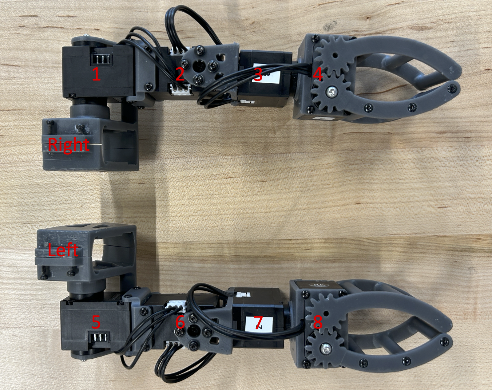
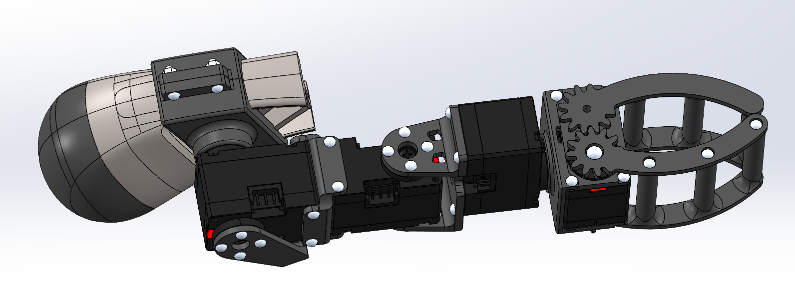
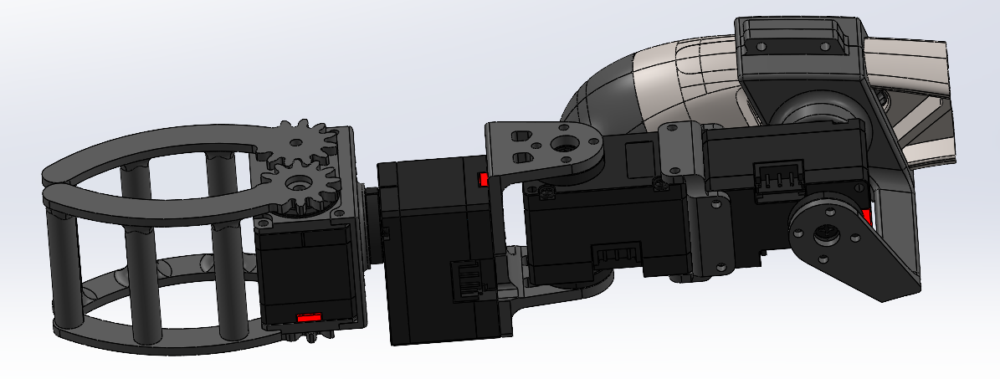

<!-- <h1 align="center">
  LocoMan
</h1> -->
<h2 align="center">
  LocoMan: Advancing Versatile Quadrupedal Dexterity with Lightweight Loco-Manipulators
</h2>

<div align="center">
  <a href="https://linchangyi1.github.io/"><strong>Changyi Lin</strong></a>,
  <a href="https://xingyul.github.io/"><strong>Xingyu Liu</strong></a>,
  <a href="https://yxyang.github.io/"><strong>Yuxiang Yang</strong></a>,
  <a href="https://yaruniu.com/"><strong>Yaru Niu</strong></a>,
  <br/>
  <a href="https://wenhaoyu.weebly.com/"><strong>Wenhao Yu</strong></a>,
  <a href="https://research.google/people/tingnan-zhang/"><strong>Tingnan Zhang</strong></a>,
  <a href="https://www.jie-tan.net/"><strong>Jie Tan</strong></a>,
  <a href="https://homes.cs.washington.edu/~bboots/"><strong>Byron Boots</strong></a>,
  <a href="https://safeai-lab.github.io/people.html"><strong>Ding Zhao</strong></a>
  <br/>
</div>

<p align="center">
    <a href="https://linchangyi1.github.io/LocoMan/"><em>Website</em></a> |
    <a href="https://arxiv.org/abs/2403.18197"><em>Paper</em></a>
</p>


<p align="center">

<br/>
<br/>

</p>

<!-- --- -->
<!-- <br/> -->

### Table of Contents
1. [Overview](#overview)
2. [Installation](#installation)
3. [Running in Simulation](#running_sim)
4. [Hardware Setup](#hardware_setup)
4. [Running in Real World](#running_real)
5. [Notes for Future Development](#notes)


## Overview <a name="overview"></a>
This repository provides the open-source files for [LocoMan](https://linchangyi1.github.io/LocoMan/).

Key features:
   - **Hardware**: Files available in `.sldprt` and `.sldasm` formats for development, and `.stl` format for fabrication.
   - **System**: Unified codebase for both simulation and real robot deployment, toggled via the `--use_real_robot` argument. It also contains a Python-based whole-body impulse controller.

## Installation <a name="installation"></a>
#### Basic Installation
1. Create a conda environment with python3.8:
   ```bash
   conda create -n locoman python=3.8
   ```
2. Install the dependencies:
   ```bash
   conda activate locoman
   pip install -e .
   conda install pinocchio -c conda-forge
   ```
   Note that the `numpy` version should be no later than `1.19.5` to avoid conflict with the Isaac Gym utility files. But we can modify 'np.float' into 'np.float32' in the function 'get_axis_params' of the python file in 'isaacgym/python/isaacgym/torch_utils.py' to resolve the issue. So don't worry about the version limitation.
3. Install [ROS Neotic](https://wiki.ros.org/noetic/Installation/Ubuntu) (we only test the code on Ubuntu 20.04).

#### Isaac Gym Installation (required only for simulation)
1. Download [IsaacGym Preview 4](https://developer.nvidia.com/isaac-gym).
2. Install IsaacGym:
   ```bash
   conda activate locoman
   cd isaacgym/python && pip install -e .
   ```
3. Try running an example `cd examples && python 1080_balls_of_solitude.py`. The code is set to run on CPU so don't worry if you see an error about GPU not being utilized.

#### Go1 SDK Installation (required only for real robot deployment)
1. Download the SDK:
   ```bash
   cd locoman
   git clone https://github.com/unitreerobotics/unitree_legged_sdk.git
   ```
2. Make sure the required packages are installed, following Unitree's [guide](https://github.com/unitreerobotics/unitree_legged_sdk). Most notably, please make sure to install `Boost` and `LCM`:
   ```bash
   sudo apt install libboost-all-dev liblcm-dev
   pip install empy catkin_pkg
   ```
3. Then, go to the `unitree_legged_sdk` directory and build the libraries:
   ```bash
   cd unitree_legged_sdk
   mkdir build && cd build
   cmake -DPYTHON_BUILD=TRUE ..
   make
   ```

## Running in Simulation <a name="running_sim"></a>
1. Start ROS:
   ```bash
   roscore
   ```
2. Run the Joystick (for a better understanding of the teleoperation process, it's recommended to review the comments in [joystick.py](/teleoperation/joystick.py)):
   ```bash
   python teleoperation/joystick.py
   ```
3. Run LocoMan in Simulation:
   - By default, the robot is equiped **with** two manipualtors. To run:
      ```bash
      python script/play_fsm.py
      ```
   - For playing a pure Go1 robot **without** manipulators, run:
      ```bash
      python script/play_fsm.py --use_gripper=False
      ```


## Hardware Setup <a name="hardware_setup"></a>
If you have a Unitree GO1 robot but do not plan to build the loco-manipulators, you can skip the hardware setup and still use this repository for locomotion and foot-based manipulation. However, to access the full functionality of LocoMan on a real robot, you will need to build a pair of loco-manipulators.

#### Bill of Materials
To begin, gather the following materials. For easier servo configuration, consider purchasing the [DYNAMIXEL Starter Set](https://www.robotis.us/dynamixel-starter-set-us/) instead of just the DYNAMIXEL U2D2 (ID 9 in the BOM).

| ID | Part                                      | Description                              | Price (per unit) | Quantity |
|----|-------------------------------------------|-----------------------------------|--------------|----------|
| 0 | [Unitree Go1 Robot](https://www.unitree.com/go1/) | Edu version |  | 1 |
|1-8| [DYNAMIXEL XC330-T288-T](https://www.robotis.us/dynamixel-xc330-t288-t/) | Servos for the manipulators | $89.90 | 8 |
| 9 | [DYNAMIXEL U2D2](https://www.robotis.us/u2d2/) | Convert control signals from PC to servos | $32.10 | 1 |
| 10 | [3P JST Expansion Board](https://www.robotis.us/3p-jst-expansion-board/) | Combine control signal and power to the manipulators | $5.90 | 1 |
| 11 | [100cm 3 Pin JST Cable (5pcs)](https://a.co/d/86x52YO) | Connect manipulators to the expansion board | $10.19 | 1 |
| 12 | [24V to 12V 10A Converter](https://a.co/d/bhacse1) | Convert 24V power from Go1 to 12V for the manipulators | $9.75 | 1 |
| 13 | [30cm XT30 Connector (2pcs)](https://a.co/d/2ftzIKc) | Connect Go1 power supply to the converter | $8.59 | 1 |
| 14 | [20ft Ethernet Cable](https://a.co/d/bZTsqN4) | Connect PC to Go1 | $18.99 | 1 |
| 15 | [20ft USB Extension Cable](https://a.co/d/3ieBPJI) | Connect PC to U2D2 | $18.99 | 1 |
| 16 | [Bearings 5x8x2.5mm (10pcs)](https://a.co/d/0Kc5usm) | Bearings for the rotational gripper | $8.19 | 1 |
| 17 | [M2 Screws: 22x4cm, 24x6cm, 48x10cm; Nuts: 8xM2](https://a.co/d/6fwfDas) | Used for assembly | $8.29 |1|
| 18 | [M2.5 Screws: 2x10cm, 2x6cm](https://a.co/d/dnSxZVM) | Used for assembly | $11.99 |1|
| 19 | [Spring Washer: 24xM2, 2xM2.5](https://a.co/d/fyb38Bh) | Used for assembly | $9.99 |1|
| 20 | [Joystick (optional)](https://a.co/d/8otPZM6) | Refer to [joystick.py](/teleoperation/joystick.py) |  |1|
| 21 | [Printed parts](/LocoMan_Hardware/print) | 3D print them |  |1|

#### Configure the servos
Use [Dynamixel Wizard](https://emanual.robotis.com/docs/en/software/dynamixel/dynamixel_wizard2/) to adjust the ID, baud rate, and latency (reference to the [guide](https://github.com/ROBOTIS-GIT/DynamixelSDK/issues/316)). Make the following changes:

- Relabel the motor IDs: [1, 2, 3, 4] for the **right** manipulator and [5, 6, 7, 8] for the **left** manipulator.
- Set the baud rate to 1000000.
- Set the return delay time to 0.


#### Assemble the manipulators
   - Refer to [the image of the IDs of the servos](/source/manipulators.png) to select the correct servos for the corresponding manipulators
   

   - Check out [loco-manipulator_left_fabrication.SLDASM](/LocoMan_Hardware/assembly/loco-manipulator_left_fabrication.SLDASM) to see how to assemble the manipulators using servos, screws, nuts, and spring washers. It's important that the left manipulator appears as shown below when all servos are in their zero positions.
   

   - Note that the zero positions of the servos differ between the simulation and the real manipulators. Specifically, in simulation (URDF), the first servo of each manipulator points forward, as seen in [loco-manipulator_left_urdf.SLDASM](/LocoMan_Hardware/loco-manipulator_left_urdf.SLDASM). Therefore, during the assembly process, you should refer to [loco-manipulator_left_fabrication.SLDASM](/LocoMan_Hardware/loco-manipulator_left_fabrication.SLDASM).
   


### Setup the robot
We use the following setup to perform the demos in the paper. A desktop sends control signals to the robot via an Ethernet cable (ID-14) and to the manipulators via a USB cable (ID-15). Before running the code, make sure to turn on the Go1 robot, which will also power the servos.


#### Enable the USB Port
Once the hardware is ready, connect the USB to your computer and power on the robot. Then, check the USB ID and enable the USB device for communication (modify the USB ID based on the output of the first command):
   ```bash
   lsusb
   sudo chmod 777 /dev/ttyUSB0
   ```

Additionally, update the installed SDK by setting LATENCY_TIMER = 1 in the file /dynamixel_sdk/port_handler.py.

#### Running LocoMan in Real World <a name="running_real"></a>
1. Similar to running in simulaiton, start ROS and the Joystick in separate terminals:
   ```bash
   roscore
   ```
   ```bash
   python teleoperation/joystick.py
   ```

2. Deploy on the Real Robot:
   - **Without manipulators**: Run the following command:
      ```bash
      python script/play_fsm.py --use_real_robot=True --use_gripper=False
      ```
   - **With manipulators**: Before running LocoMan, the manipulators need to be initialized.
      - First, start the manipulators:
         ```bash
         python manipulator/run_manipulators.py
         ```
      - Then, run the FSM:
         ```bash
         python script/play_fsm.py --use_real_robot=True
         ```


## Notes for Future Development <a name="notes"></a>
#### Operation Modes
- **Locomotion.** The locomotion planners and state estimator are adapted from Yuxiang's previous projects [Fast and Efficient Locomotion](https://github.com/yxyang/fast_and_efficient) and [CAJun](https://github.com/yxyang/cajun). Since the demos were conducted indoors, the locomotion planners were simplified to handle flat terrain only. If you plan to use the locomotion feature on uneven terrain, you’ll need to enhance it using the mentioned repos.
- **Loco-Manipulation.** This mode is designed to maintain a target orientation for the gripper during locomotion. Tracking a full 6D pose of the gripper while using only the rest three legs for locomotion presents a much greater challenge, which was not explored in this project.
- **Single-Arm Manipulation.** The transition from stance to single-gripper manipulation involves two steps: (a) adjusting the torso, and (b) moving the foot and manipulator. Achieving smoother and more efficient transitions remains an open challenge. Additionally, issues like singularity and collision still need to be addressed.
- **Bimanul-Manipulation.** The transition trajectories were recorded by executing Unitree's high-level controller to perform the action of making a traditional Chinese salute. For details, refer to the [trajectory extraction code](/bimanual_trajectory/trajectory_extraction.py). Note that you may need to collect new trajectories if you change the robot’s hardware configuration or use a different robot.


#### Simulation
- **Simulate before Deploy.** Although the paper presents results from real robot deployment, we also developed a simulation of LocoMan using the Isaac Gym simulator. This simulation helps a lot for debugging and safeguarding the real robot during system development. To support future work, we also open souce the code of the LocoMan simulation.
- **Parallel Simulation.** The simulation environment was originally designed to be GPU-parallel, as we initially planned to leverage RL to train a controller for LocoMan. However, due to poor tracking performance, we moved away from learning-based methods. Therefore, the current simulation environment is only partially parallel, where each robot instance has its own instance of [the WBC class](./wbc/whole_body_controller.py)


- **Collision Model.** In this project, we did not test the manipulator’s grasping functionality, so the gripper is modeled as a rigid body in simulation. To simulate manipulation tasks, you’ll need to create a new URDF using the open-source [CAD models](/LocoMan_Hardware). In addition, we modified the collision model for the thigh motors. Please ensure the torso doesn't interact with the environment if you use the provided urdf in your project.


#### Teleoperation
- The function `_update_human_command_callback` in each commander comes from the original development in the paper. However, it does not work in this codebase because other parts have been refined. If you plan to teleoperate LocoMan using human motion, please note that these functions are provided as examples and will need to be overwritten with your own implementations.

## Acknowledgements
This repository is developed with inspiration from these repositories: [CAJun](https://github.com/yxyang/cajun), [LEAP Hand](https://github.com/leap-hand/LEAP_Hand_API), and [Cheetah-Software](https://github.com/mit-biomimetics/Cheetah-Software/tree/master). We thank the authors for making the repos open source.


